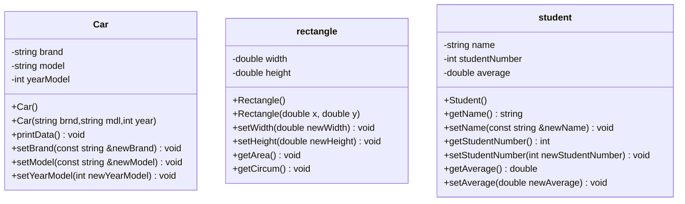

# C++ : Class and Object
# UML Diagram

```mermaid
classDiagram
    class Car{
    -string brand
    -string model
    -int yearModel

    +Car()
    +Car(string brnd,string mdl,int year)
    +printData() void 
    +setBrand(const string &newBrand) void 
    +setModel(const string &newModel) void  
    +setYearModel(int newYearModel) void 
    }

    class rectangle{
    -double width
    -double height

    +Rectangle()
    +Rectangle(double x, double y)
    +setWidth(double newWidth) void
    +setHeight(double newHeight) void
    +getArea() void
    +getCircum() void
    }

    class student{
    -string name
    -int studentNumber
    -double average

    +Student()
    +getName() string
    +setName(const string &newName) void
    +getStudentNumber() int
    +setStudentNumber(int newStudentNumber) void
    +getAverage() double
    +setAverage(double newAverage) void
    }

```

### Primary source:
Alaluukas, P. 2026. Olio-ohjelmointi C++-kielellä. Luettavissa: https://peatutor.com/cplus/ Luettu: 10.11.2026.