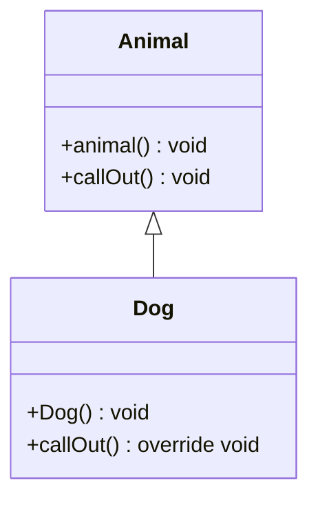

# inheritance and polyforms

```mermaid
classDiagram
    class Animal{
        +animal() void
        +callOut() void
    }
    class Dog{ 
        +Dog() void
        +callOut() override void
    }
    Animal <|-- Dog
```

Primary source:

Alaluukas, P. 2026. Olio-ohjelmointi C++-kielellä. Luettavissa: https://peatutor.com/cplus/ Luettu: 11.11.2026.